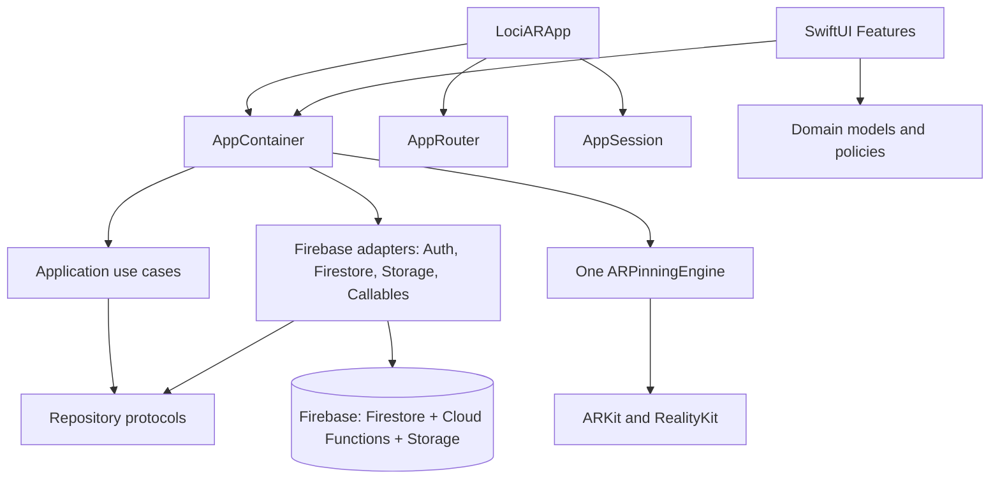
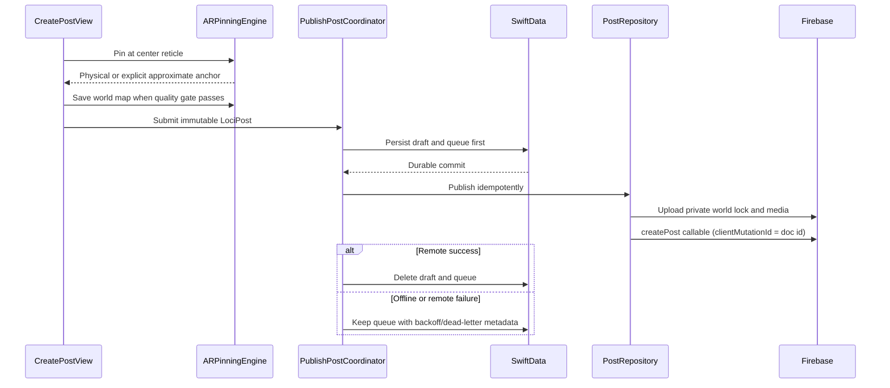
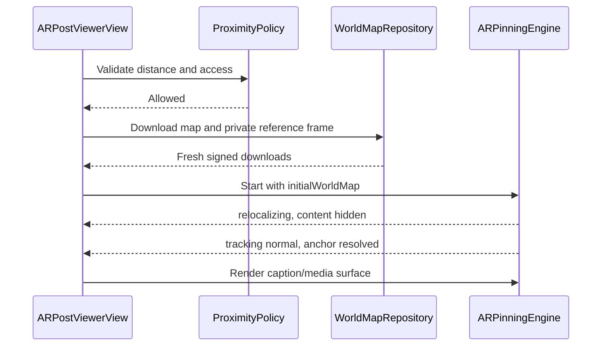

# LociAR Native iOS Architecture

LociAR is an iOS 17+ SwiftUI application. It has no Expo, React Native, JavaScript runtime, or native bridge.

## Dependency direction

Rules enforced by tests:

- `AppContainer` is the only composition root.
- Feature files cannot construct Firebase or Storage adapters.
- `ARPinningEngine()` is constructed exactly once in production source.
- Published social state remains server-authoritative; SwiftData is draft, queue, retry, preference, and cache storage only.

## Pin and publish transaction

Normal Pin never produces a free-space anchor. Approximate placement is a separate user decision at 0.8 m and remains labelled approximate everywhere.

## Restore transaction

World-map and reference-image records persist only `storage://` paths. Download URLs are resolved from Firebase Storage at download time and are never written into the post contract.

## Server authority

Posts, profiles, counters, activity and account deletion are written only by Cloud Functions (`functions/src`). The iOS client never falls back to direct writes; see the security contract in `AGENTS.md`.

## Engagement truth

- Like, comment, save and follow counters are maintained only by Cloud Functions Firestore triggers; clients cannot write them (rules deny).
- The `recordPostView` callable requires an authenticated user, enforces visibility/block rules, and deduplicates by post, user, and UTC day.
- The client replaces its view count with the callable result instead of inventing a local success count.
- Spotify, YouTube, and X URLs pass a strict HTTPS host/path allow-list. Their AR surface card always includes the post caption and platform identity.

## Lifecycle and recovery

- Firebase Auth state changes drive sign-in, sign-out, token refresh, and user updates through `AuthRepository`.
- The offline queue runs after sign-in, network restoration, and foreground activation.
- Retry uses capped exponential backoff and moves repeatedly failing work to a dead letter state.
- AR sessions stop outside AR screens and explicitly handle backgrounding, interruption, thermal pressure, and relocalization timeout.

## Release evidence boundary

Simulator builds and UI tests prove source/runtime navigation, not physical world locking. Public release still requires a signed physical-device build, a Firebase deploy (`scripts/firebase-deploy.command`), and LiDAR plus non-LiDAR field evidence from `FIELD_TEST_CHECKLIST.md`.

