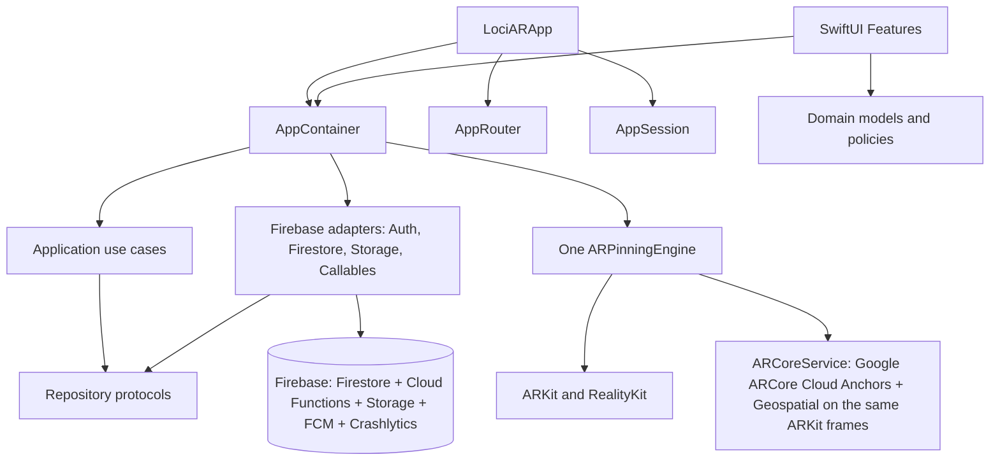
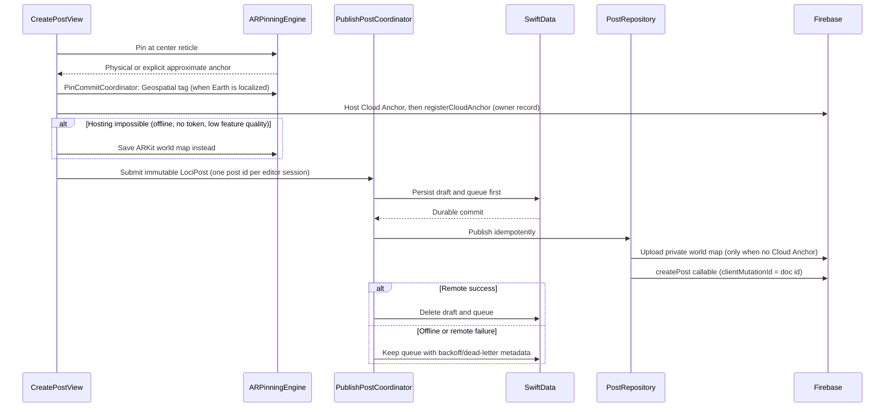

# LociAR Native iOS Architecture

LociAR is an iOS 17+ SwiftUI application. It has no Expo, React Native, JavaScript runtime, or native bridge.

## Dependency direction



Rules enforced by tests:

- `AppContainer` is the only composition root.
- Feature files cannot construct Firebase or Storage adapters.
- `ARPinningEngine()` is constructed exactly once in production source.
- Published social state remains server-authoritative; SwiftData is draft, queue, retry, preference, and cache storage only.

## Pin and publish transaction



Normal Pin never produces a free-space anchor. Approximate placement is a separate user decision at 0.8 m and remains labelled approximate everywhere.

## Restore transaction

```mermaid
sequenceDiagram
    participant UI as ARPostViewerView
    participant Policy as ProximityPolicy
    participant ARCore as ARCoreService
    participant Store as WorldMapRepository
    participant AR as ARPinningEngine

    UI->>Policy: Validate distance and access
    Policy-->>UI: Allowed
    UI->>ARCore: 1. Resolve Cloud Anchor (exact surface)
    UI->>ARCore: 2. Geospatial pose (outdoors, VPS coverage)
    UI->>Store: 3. Download ARKit world map and relocalize
    UI->>AR: 4. Aim-guided reveal by GPS bearing and distance
    Note over UI: Each stage checks cancellation; after 8 s "Yaklaşık göster" jumps to stage 4
    UI->>AR: Render caption / text card
```

World-map records persist only `storage://` paths. Download URLs are resolved from Firebase Storage at download time and are never written into the post contract. No camera frames or reference images are stored.

## Server authority

Posts, profiles, counters, activity, push devices and account deletion are written only by Cloud Functions (`functions/src`). The iOS client never falls back to direct writes; see the security contract in `AGENTS.md`.

## Engagement truth

- Like, comment, save and follow counters are maintained only by Cloud Functions Firestore triggers; clients cannot write them (rules deny).
- The `recordPostView` callable requires an authenticated user, enforces visibility/block rules, and deduplicates by post, user, and UTC day.
- The client replaces its view count with the callable result instead of inventing a local success count.
- Posts are text only. Social media links were removed on 9 Oct 2026; the server refuses any URL and clients ignore links stored on older posts.

## Lifecycle and recovery

- Firebase Auth state changes drive sign-in, sign-out, token refresh, and user updates through `AuthRepository`.
- The offline queue runs after sign-in, network restoration, and foreground activation.
- Retry uses capped exponential backoff and moves repeatedly failing work to a dead letter state.
- AR sessions stop outside AR screens and explicitly handle backgrounding, interruption, thermal pressure, and relocalization timeout.

## Release evidence boundary

Simulator builds and UI tests prove source/runtime navigation, not physical world locking. Public release still requires a signed physical-device build, a Firebase deploy (`scripts/firebase-deploy.command`), and LiDAR plus non-LiDAR field evidence from `FIELD_TEST_CHECKLIST.md`.

## ARCore and anchor ownership

ARCore (Cloud Anchors, Geospatial) runs on the existing ARKit session and authorizes through the keyless `getArcoreToken` callable. A hosted Cloud Anchor is registered with `registerCloudAnchor` (`cloud_anchors/{id}` = owner, post binding); `createPost` binds it to exactly one post of its owner in a transaction, and delete paths touch only anchors bound to the post being deleted. Failed anchor deletions are queued in `cloud_anchor_deletions` and retried by `cleanupPostMedia`. Resolution order and thresholds: `docs/AR_WORLD_LOCK.md`. Placement fields (`placement_state`, `native_provider`, `resolver_strategy`) are derived on the server, never taken from the client.

## Push, kill switch, crash reports, localization

- Push: `NotificationService` registers the FCM token with `registerPushToken` after sign-in and removes it with `unregisterPushToken` before sign-out. Cloud Functions send like/comment/follow pushes with `loc-key`s (`push.like`, `push.comment`, `push.follow`) that iOS localizes on the device.
- Kill switch: `system/flags.kill_switch` (admin System page) makes write callables return `unavailable` / `service_paused`; the app shows a paused message and keeps queued posts without spending retries.
- Crashlytics: enabled by default, opt-out in Profile → Settings (`CrashReportingPreference`); dSYMs are uploaded by a Release build phase.
- Localization: 12 languages in `Localizable.xcstrings` and `InfoPlist.xcstrings`, generated by `scripts/l10n/build_catalog.py`. Keys are the Turkish source strings; the development region is `en`.
