> **ARŞİV (28 Eylül 2026):** Bu belge Supabase dönemine aittir. Backend artık Firebase — güncel kaynaklar: `AGENTS.md`, `docs/FIREBASE_SETUP.md`, `ARCHITECTURE.md`.

ben # LociAR Architecture and Flow Diagrams

Updated: 2026-08-09  
Scope: iOS user app, Supabase backend, web/mobile admin, native Visual Surface/ARKit bridge  
Source of truth: current repository code and migrations. Dashed nodes are planned or externally gated.

## 1. User Flow Diagram

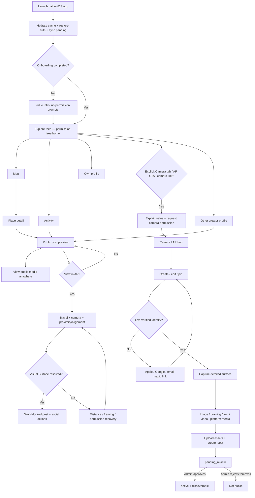

## 2. Wireflow Diagram

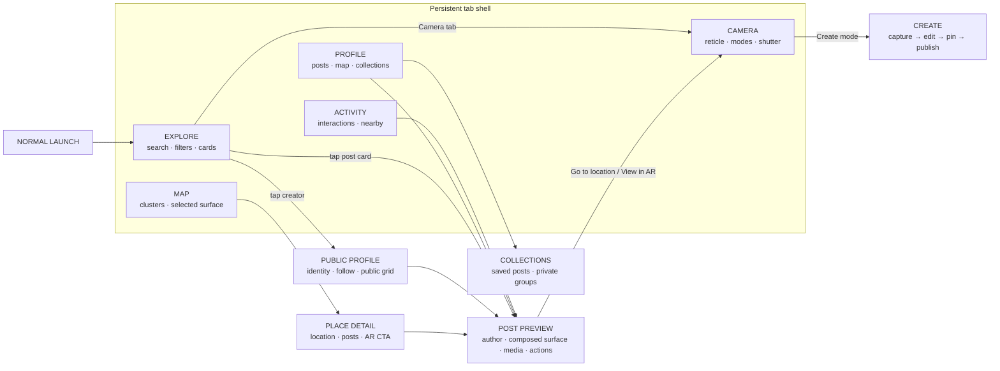

## 3. Task Flow Diagram — Browse Another User's Public Post

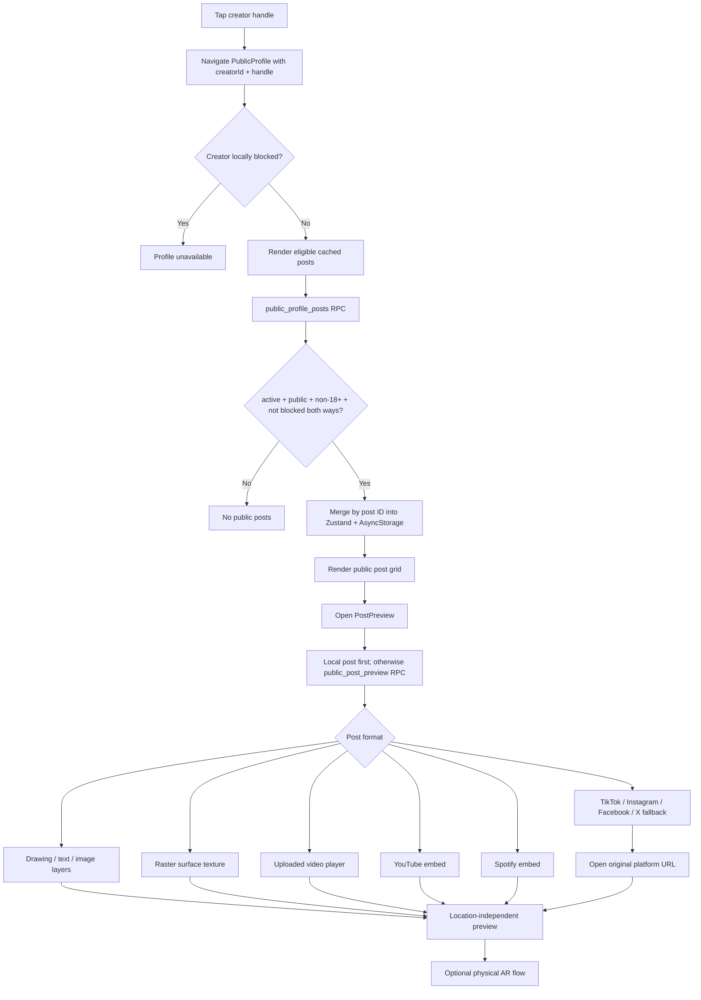

## 4. App Map / Information Architecture

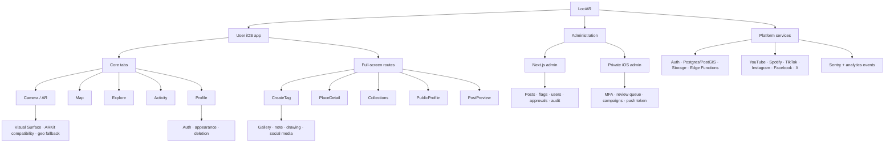

## 5. Application State Diagram

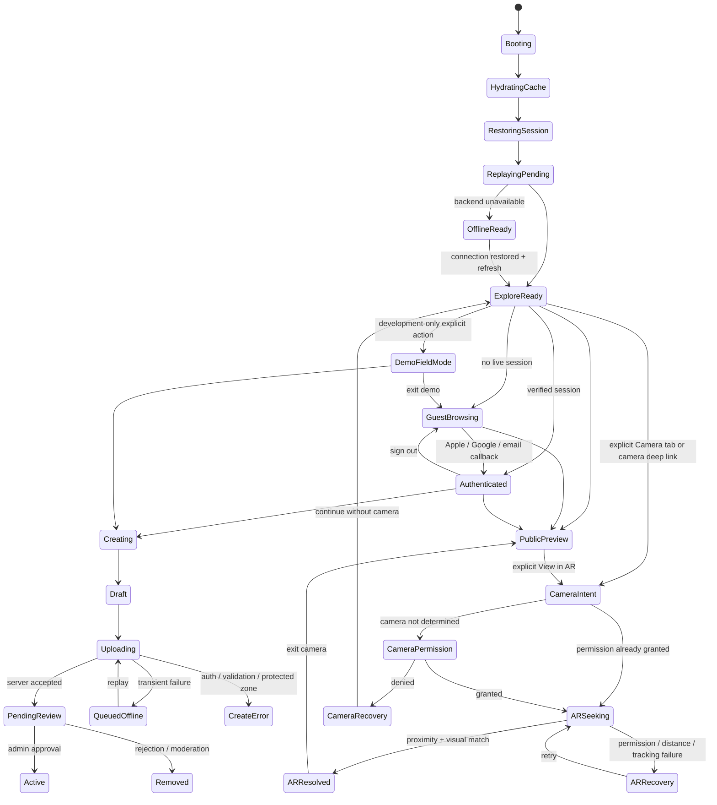

State ownership:

- Zustand: posts, current user, loading, pending sync, saves, follows, blocks, likes, local analytics.
- Component state: route-specific loading, selected tabs/filters, camera permissions, AR resolver, editor draft, media playback.
- AsyncStorage: durable cache and offline queue.
- Supabase: authoritative online identity, content, moderation, social graph, storage, audit.

## 6. Navigation Flowchart

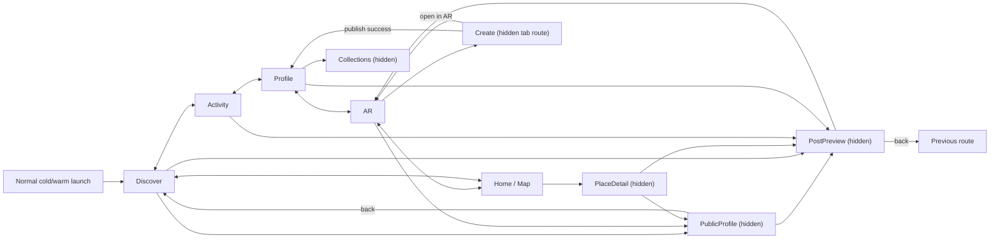

Invariant: hidden routes own their full-screen chrome; the floating tab bar is not rendered over Create, PlaceDetail, Collections, PublicProfile, or PostPreview.

Launch invariant: `Discover` is the normal initial route. `AR` is reached only by an explicit Camera tab/AR CTA action or the intentional `lociar://camera` deep link.

## 7. Deep Linking Mapping

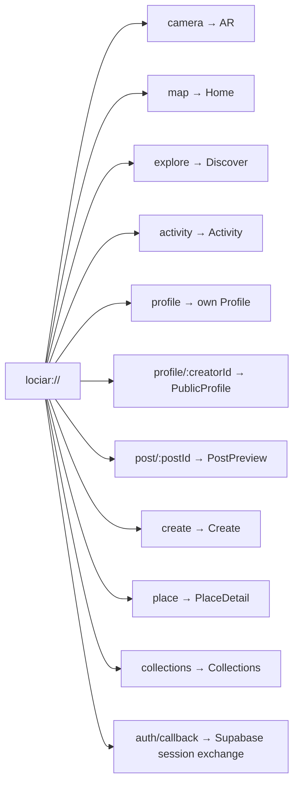

Deep-link rules:

- Route parameters stay JSON-serializable; stable IDs are canonical.
- `PostPreview` fetches through `public_post_preview` when the post is absent from cache.
- A private, unapproved, removed, 18+, or block-conflicting post resolves to “Post unavailable.”
- Auth callback accepts PKCE `code` or access/refresh tokens, then restores the application session.
- A `lociar://camera` cold start is treated as explicit user intent; an ordinary icon launch never resolves to `AR`.

## 8. Error Handling and Edge Case Flow

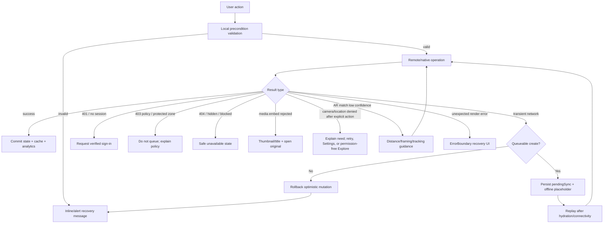

Required behavior: startup and onboarding never trigger camera/location permission; no false-success state for failed like/comment/save/follow mutations; no blank media panel; no silent AR resolver failure; permanent policy failures never enter the offline queue.

## 9. System Architecture Diagram

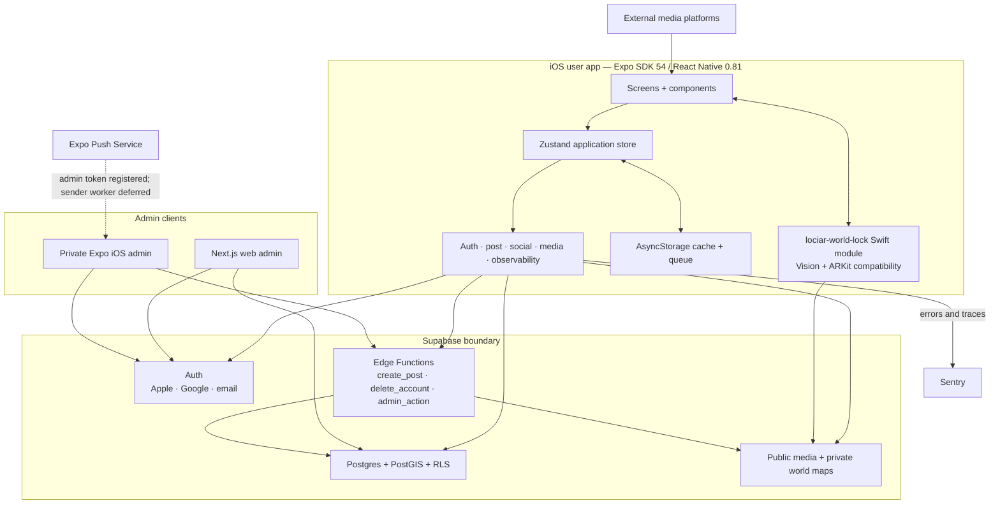

Security boundaries:

- Mobile receives only the Supabase anon key; service-role remains server-side.
- Public profile RPCs expose only moderated public safe content and enforce blocks in both directions.
- Admin writes require authenticated owner/moderator permissions, MFA `aal2`, rate limits, reason/idempotency, and audit.

## 10. UML Sequence Diagram — Public Profile and Post Preview

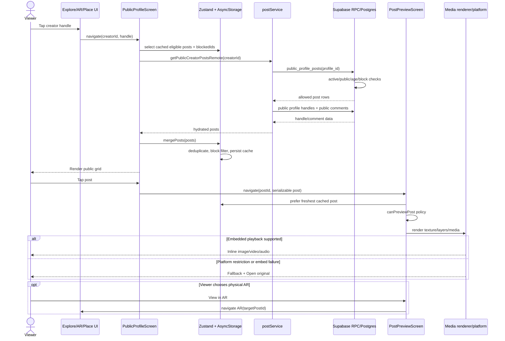

## 11. Data Flow Diagram (DFD)

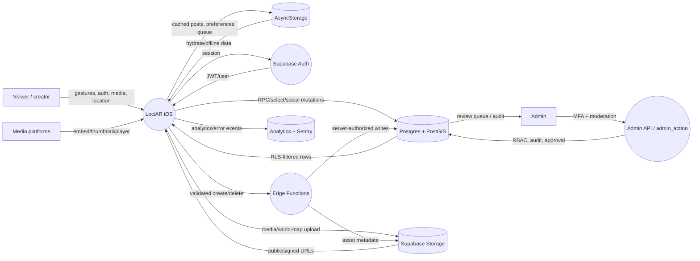

## 12. API Integration Map

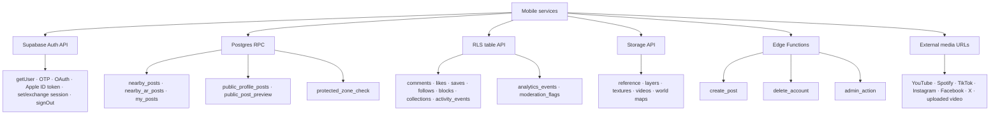

API result policy:

- Reads: safe empty state for offline/schema-unavailable discovery; security-sensitive preview RPCs fail closed.
- Creates: only transient failures queue; auth, validation, policy, rate-limit, and protected-zone failures surface immediately.
- Social mutations: optimistic UI must rollback when the authoritative remote mutation fails.
- Media: inline playback when supported; explicit external fallback otherwise.

## 13. Push Notification Logic Flow

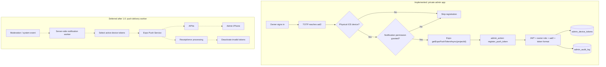

Current truth: token registration exists for the private admin iOS app. A production sender/receipt worker and end-user push notifications are explicitly deferred; activity feed records are in-app notifications, not APNs delivery.

## 14. Entity Relationship Diagram (ERD)

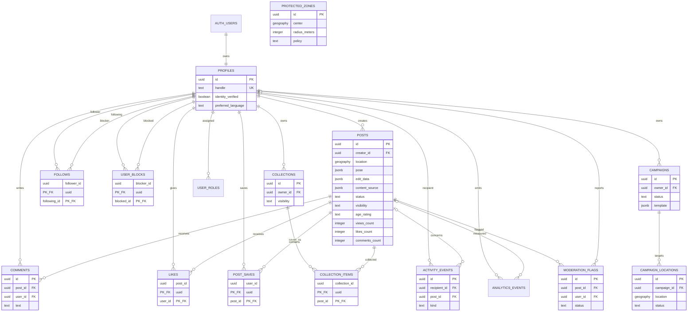

Admin-operation entities extend this core model: `admin_roles`, `admin_permissions`, `admin_role_permissions`, `admin_role_assignments`, `admin_sessions`, `admin_rate_limits`, `admin_approval_requests`, `admin_metric_changes`, `admin_user_invites`, `user_enforcements`, `admin_audit_log`, and `admin_device_tokens`.

## 15. Local Caching and Sync Logic Flow

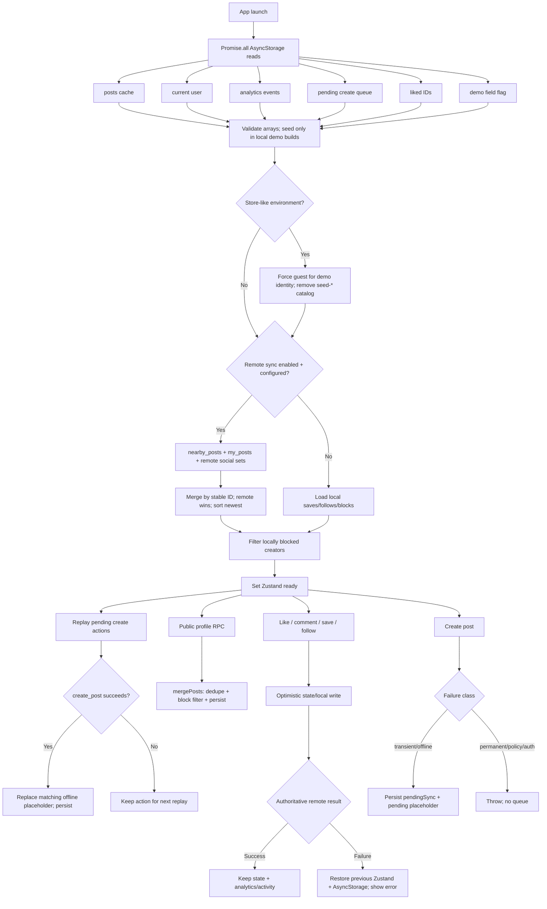

Cache keys:

- `lociar_posts_v4_mockup`
- `lociar_current_user_v4_mockup`
- `lociar_events_v1`
- `lociar_pending_sync`
- `lociar_liked_posts_v1`
- `lociar_demo_field_mode_v1`
- `lociar_saved_posts_v1`, `lociar_follows_v1`, `lociar_blocks_v1`, `lociar_collections_v1`
- theme and onboarding preference keys

## Cross-Layer Invariants

1. Remote preview and physical AR unlock are separate capabilities.
2. Other-user profile content is `active + public + non-18+` only and is block-aware in both directions.
3. Own pending/private safe content may be previewed locally by its creator but never returned by public preview RPCs.
4. Stable UUIDs drive data access; display handles are metadata, not authorization identifiers.
5. The mobile client never owns moderation authority or a service-role key.
6. Media must render inline or expose an explicit external fallback; blank surfaces are failures.
7. Transient create failures may queue. Permanent auth, validation, moderation, age, or protected-zone failures must fail immediately.
8. Optimistic social state rolls back when the authoritative remote write fails.
9. Cache merge is ID-based, block-filtered, and deterministic.
10. Push delivery is not claimed until a server sender and receipt processor exist.
11. Normal launch is Explore-first and permission-free; camera/location access follows an explicit user action.
12. Store-like startup never presents a mock identity or bundled seed catalog as production data.

## 16. Permission-Safe Launch Contract

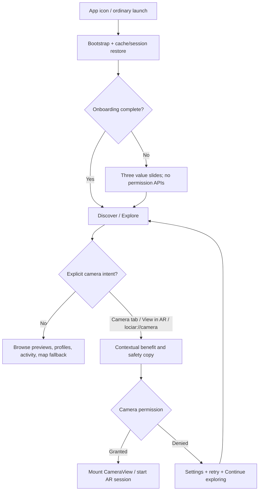

Acceptance contract:

- On a clean install, completing or skipping onboarding displays `screen-explore`; no camera/location system sheet appears.
- On a returning ordinary launch, `Discover` is selected and the lazy `ARCameraScreen` is not mounted.
- Camera starts only after the Camera tab, a `View in AR` CTA, or the explicit camera deep link.
- Denial always returns a usable permission-free route; it never creates a blank camera surface or launch loop.
- Preview/production starts with a guest identity and remote/cache content only; development demo data remains opt-in tooling.

## 17. Architecture Gap Register

```mermaid
flowchart TD
  Release["Production-ready LociAR"]
  Release --> Security["Security and privacy"]
  Release --> Navigation["Navigation and deep links"]
  Release --> Data["Data and synchronization"]
  Release --> Media["Media safety and playback"]
  Release --> Operations["Operations and evidence"]

  Security --> G1["P0: Apply public-preview migration and hosted adversarial tests"]
  Security --> G2["P0: Enforce two-way blocks on every public post read path"]
  Security --> G3["P0: Require live identity for online social mutations"]
  Navigation --> G4["P1: Root native stack over the five-tab shell"]
  Navigation --> G5["P1: Typed routes, auth callback route, universal links"]

  Data --> G6["P1: User-scoped cache keys and complete account/reset cleanup"]
  Data --> G7["P1: Typed/idempotent queue with retry, backoff, and dead-letter state"]
  Data --> G8["P2: Pagination, cache eviction, creator/comment batching"]
  Data --> G16["P1: Public profile projection and real profile metadata"]

  Media --> G9["P0: HTTPS/platform allowlist and WebView navigation policy"]
  Media --> G10["P1: Physical-device matrix for every supported post format"]

  Operations --> G11["P0: Hosted golden-path and physical Visual Surface evidence"]
  Operations --> G12["P2: Push sender, receipts, invalid-token cleanup"]
  Operations --> G13["P2: Production dashboards, alerts, and sync health metrics"]
```

### Gap status after implementation

| ID | Priority | Architecture area | Current gap | Required completion | Acceptance evidence |
| --- | --- | --- | --- | --- | --- |
| G1 | P0 | Backend / database | **Local closed; hosted pending.** Preview/profile/idempotency migrations are applied and local smoke-tested. | Deploy the same ordered migrations to staging/production. | Anonymous and authenticated RPC tests pass against hosted staging. |
| G2 | P0 | Security / DFD | **Closed locally.** One block-aware predicate now governs public post RLS, comments, nearby reads, and preview RPCs. | Re-run the adversarial matrix on hosted staging. | A blocks B and B blocks A return no cross-user posts/comments from every endpoint. |
| G3 | P0 | State / API | **Closed.** Online social mutations require a live verified Supabase identity before local mutation. | Keep auth-policy regression tests in the release gate. | Guest action has no local success; authenticated action persists remotely. |
| G4 | P1 | Navigation / wireflow | **Closed.** A typed root native stack now owns full-screen routes over the five-tab shell. | Complete physical back-gesture/device verification. | Back gestures, tab state retention, modal chrome, and direct links behave consistently. |
| G5 | P1 | Deep linking | Route names/params are untyped; only the custom scheme is configured; `auth/callback` is created by auth code but not represented in the navigation map. | Define a typed root param list, explicit auth callback handler, associated-domain/universal-link mapping, invalid-ID parsing, and cold/warm-start tests. | Custom and universal links pass cold-start, foreground, expired-session, invalid-ID, and auth callback tests. |
| G6 | P1 | Local storage / ERD | **Closed for social state.** Saves, follows, blocks, likes, collections, and queues are user-scoped; account deletion clears the scope. | Extend the same contract if new private caches are introduced. | Automated account-isolation test plus reset/delete key audit. |
| G7 | P1 | Sync logic | **Core closed.** Queue items are typed/versioned/user-scoped, use a UUID idempotency key, exponential retry metadata, exact placeholder IDs, and dead-letter state. | Add a user-facing retry/discard panel for dead letters. | Edge smoke proves an idempotent replay returns the same post. |
| G8 | P2 | Performance / data | Public profiles load a fixed batch; global cache grows without eviction; handle/comment hydration adds extra requests; collections perform item N+1 reads. | Add cursor pagination, bounded normalized cache, batched profile/comment payloads, and collection aggregation RPC/view. | Large-account profiling meets documented latency/memory/query-count budgets. |
| G9 | P0 | Media / security | **Closed in code.** HTTPS/provider allowlists, credential rejection, WebView navigation interception, popup blocking, and external-leave confirmation are active. | Complete real-device provider playback matrix. | Malicious scheme/host tests pass; valid providers retain playback/fallback. |
| G10 | P1 | UI/UX / media | Unit tests cover media capability selection, but real-device playback, app switching, audio focus, interruption, accessibility, and degraded-network behavior are not evidenced for every format. | Run an iPhone matrix for texture/layers/image/uploaded video/YouTube/Spotify/TikTok/Instagram/Facebook/X with success and fallback states. | Recorded device checklist and screenshots/video for each media type and failure mode. |
| G11 | P0 | Release / AR | **Docker/local closed; hosted and physical pending.** Supabase, Expo, and admin containers build and run; all local health/smoke gates pass. | Deploy hosted staging, then run auth → publish → approve → remote preview → physical AR → social → delete. | D1 golden-path log plus physical-iPhone field evidence. |
| G12 | P2 | Push | Private admin token registration exists; server sender, event routing, Expo receipts, token invalidation, preferences, and end-user push do not. | Implement a server-owned outbox/worker and receipt processor after notification product policy is approved. | Idempotent delivery tests, invalid-token cleanup, opt-out, and deep-link handling pass. |
| G13 | P2 | Observability | Sentry and analytics hooks exist, but there is no production SLO/alert model for preview RPC failures, queue age, media fallback rate, AR resolve rate, or notification delivery. | Define privacy-safe metrics, dashboards, alert thresholds, release tags, and correlation IDs. | Staging fault injection produces actionable alerts without logging media, precise location, or secrets. |
| G14 | P2 | Database contracts | **Closed for v1 writes.** Database checks validate pose, edit canvas/layers, and optional content/calibration/resolver/anchor JSON contracts. | Add explicit v2 migration rules before introducing v2 documents. | Malformed/unknown versions fail safely; v1 remains readable. |
| G15 | P2 | UI/UX quality | The new flows need dedicated accessibility, localization, dynamic-type, reduced-motion, offline, empty, loading, and retry verification. | Add screen-level tests and iPhone QA for PublicProfile/PostPreview plus TR/EN copy review. | VoiceOver order, 200% text, reduced motion/transparency, narrow device, offline, and retry scenarios pass. |
| G16 | P1 | Profile / information architecture | **Closed locally.** A privacy-limited profile projection returns handle, avatar, bio, post/follower/following counts without private identity fields. | Validate the hosted projection with anonymous/authenticated roles. | Both viewers receive the same approved projection without email, phone, roles, or private fields. |
### Gaps closed in the 2026-08-09 pass

| Area | Closed gap |
| --- | --- |
| User flow | Other-user public posts now have a location-independent profile and post-preview route; AR proximity is a separate explicit action. |
| Visibility | New preview RPCs fail closed for status, visibility, age rating, and two-way blocks. |
| Media | Surface texture, drawing/text/image layers, image media, uploaded video, YouTube, Spotify, and restricted-platform fallback paths are represented by one preview renderer. |
| Shared state | Remotely fetched profile posts merge by stable post ID into Zustand and AsyncStorage. |
| Mutation correctness | Failed comment, like, save, and follow writes rollback their optimistic local state. |
| Documentation | UI/UX, state, navigation, deep links, errors, backend, API, push, ERD, and cache/sync diagrams now share one set of invariants. |
| Permission-safe launch | Normal launch and onboarding land on lazy-loaded Explore; Camera/AR requires explicit intent and owns its permission recovery path. |
| Release identity | Preview/production sanitizes demo identity and bundled `seed-*` content to an explicit guest/remote-only startup. |

### Execution order

1. Deploy and re-run G1/G2/G16 tests on hosted staging before exposing public preview.
2. Close G11 with the hosted golden path and physical-iPhone evidence.
3. Complete G5 universal-domain ownership, G7 dead-letter UI, G10, and G15 before App Store UX freeze.
4. Schedule G8, G12, and G13 as measured post-foundation work; push remains outside 1.0 until product policy is approved.
