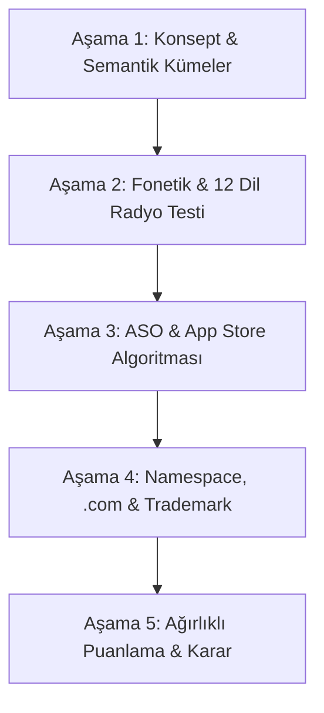

# LociAR — Marka ve Uygulama İsmi Araştırma Planı (Naming Strategy & Validation)

Bu belge; uygulamanın mevcut ismi (`LociAR`), hedeflenen küresel ve lüks/mekânsal sosyal ağ vizyonu ve `available_luxury_com_results.txt` analizleri doğrultusunda hazırlanmış kapsamlı bir araştırma ve doğrulama planıdır.

---

## 1. Problem Tanımı ve Araştırma Amacı

### Neden İsim Araştırması Yapılıyor?
1. **"AR" Takısının Riskleri:**
   - Instagram "InstaCam", Twitter "TwitWeb", BeReal "BeRealPhoto" olarak başlamadı. Teknoloji takıları (`AR`, `VR`, `AI`) uygulamayı zamanla "geçici bir teknoloji demosu" gibi hissettirme riski taşır.
   - Ana hedef: Kullanıcıların teknolojiyi değil, **"gerçek mekânlarda hikâye/bağ kurma"** deneyimini benimsemesi.
2. **"Loci" Kökünün Gücü ve Çift Taraflı Doğası:**
   - *Güçlü yönü:* Latince *locus* (yer/mekân) çoğuludur. Antik Yunan/Roma "Method of Loci" (Hafıza Sarayı) tekniğine doğrudan atıftır. Mekânsal hafıza için kavramsal olarak kusursuzdur.
   - *Zayıf yönü:* Telaffuz belirsizliği ("Losi", "Loki", "Loçi") ve İspanyolca/İtalyanca *loco* (deli) kelimesine fonetik yakınlık.
3. **Küresel (12 Dil) ve Lüks Konumlandırma:**
   - Uygulama 12 dilde (`en`, `tr`, `zh`, `hi`, `es`, `fr`, `ar`, `bn`, `pt`, `ru`, `de`, `ja`) ve tüm App Store bölgelerinde yayına çıkıyor. İsim tek bir dilde değil, küresel ölçekte doğal ve prestijli tınlamalıdır.

---

## 2. Beş Aşamalı Araştırma Metodolojisi

---

### AŞAMA 1: Semantik Kümeler ve Marka Arketipi

Aday isimler 4 stratejik kümede toplanır:

| Küme | Anlam Dünyası | Örnek Formlar | Hissiyat / Algı |
|---|---|---|---|
| **1. Hafıza & Mekân (Kavramsal)** | Yer, koordinat, anı, saray | *Loci, Locus, Topos, Memento, Vestige, Trace* | Entelektüel, kalıcı, derinlikli |
| **2. Lüks & Parlaklık (Prestige)** | Altın, aura, estetik, elit | *Aura, Auloco, Belcache, Auval, Aumark, Lumin* | Premium, şık, temiz, seçkin |
| **3. Mekânsal Eylem (Action/Verb)** | Bırakmak, sabitlemek, keşfetmek | *Drop, Pin, Cache, Anchor, Spot, Mark* | Dinamik, kolay eylemleşebilir |
| **4. Modern Neolojik (Abstract)** | Uydurma/Özgün, kısa, soyut | *Loxia, Velox, Orbia, Zentra* | Koruması kolay, nötr, global |

---

### AŞAMA 2: Fonetik, Telaffuz ve 12 Dil "Radyo Testi"

Uygulamanın desteklediği 12 dilde her aday isim şu 4 filtreden geçirilir:

1. **Radyo Testi (The Radio Test):**
   - Biri ismi bir podcast veya sohbette duyduğunda App Store arama çubuğuna tek seferde hatasız yazabiliyor mu?
   - *Örnek test:* "Loci" duyan bir Türk "Loki" mi yazar? Amerikalı "Low-sigh" mı yazar?
2. **Negatif Çağrışım Taraması (Linguistic Red Flags):**
   - 12 dilde argo, kaba, gülünç veya negatif bir kelimeyle fonetik çakışma var mı?
   - `es` (İspanyolca): *loco* (deli), *locus* (bölge).
   - `fr` (Fransızca): Telaffuz akışı (`eau`, `au`, `cache`).
   - `zh`/`ja` (Doğu Asya): Pinyin veya Katakana transkripsiyonunda akıcı söylenebilirlik.
3. **Hece Sayısı ve Ritim:**
   - 2 hece (optimal): Lo-ci, Au-ra, Bel-cache, Au-loc.
   - Ağızdan çıkış süresi < 0.6 saniye olmalı.

---

### AŞAMA 3: App Store Optimizasyonu (ASO) & Arama Hacmi

Apple App Store algoritmasında başlık mimarisi:
- **Title (30 Karakter):** `[Marka Adı]: [Birincil Anahtar Kelime]`
- **Subtitle (30 Karakter):** `[İkincil Eylem / Kategori Açıklaması]`

#### Araştırma Soruları:
1. `Loci` aramasında App Store'da ilk sırada hangi uygulamalar çıkıyor? (Tıp fakültesi hafıza uygulamaları, puzzle oyunları).
2. "AR" ibaresi başlıkta kalmalı mı yoksa alt başlığa mı itilmeli?
   - *Seçenek A:* `Loci: Real World AR Notes` (Marka saf kalır, ASO gücü alt başlığa verilir).
   - *Seçenek B:* `LociAR: Gerçek Mekânlarda AR` (Mevcut durum; arama doğrudan AR arayanı yakalar).

---

### AŞAMA 4: Dijital Varlık, `.com` ve Hukuki Uygunluk

#### 1. Alan Adı (.com) Analizi:
`available_luxury_com_results.txt` dosyasındaki 618 adet boşta olan `.com` alan adı incelendiğinde öne çıkan kökler:
- `au-` (Altın / Aura / Lüks): `auloco.com`, `aucache.com`, `aumark.com`, `auspot.com`, `auvibe.com`
- `bel-` (Güzel / Şık): `belcache.com`, `beldrop.com`, `belspot.com`, `belvault.com`
- `cache-` (Kasa / Geocache): `cachtez.com`, `cachlex.com`

#### 2. Sosyal Medya Handle Uygunluğu:
- `@appname` veya `@appnameapp` / `@getappname` formatları Instagram, X, TikTok üzerinde boşta mı?

#### 3. Ticari Marka (Trademark Clearance):
- Nice Sınıflandırması: **Sınıf 9** (Mobil yazılım) ve **Sınıf 42 / 45** (Sosyal ağ hizmetleri).
- Taramalar:
  - USPTO (ABD Patent ve Marka Ofisi) TESS veritabanı.
  - EUIPO (Avrupa Birliği Fikri Mülkiyet Ofisi).
  - TÜRKPATENT veritabanı.

---

### AŞAMA 5: Ağırlıklı Karar Matrisi (Decision Rubric)

Her aday isim 100 puan üzerinden aşağıdaki ağırlıklarla puanlanır:

| Kriter | Ağırlık | Açıklama |
|---|:---:|---|
| **Akılda Kalıcılık (Stickiness)** | %25 | İlk duyuşta hatırlanma, merak uyandırma. |
| **Global Fonetik & Radyo Testi** | %20 | 12 dilde hatasız yazılabilme ve temiz anlam. |
| **Premium & Lüks Algısı** | %20 | Estetik, kaliteli sosyal ağ hissiyatı. |
| **Dijital Varlık (.com & Handles)** | %15 | Boşta `.com` veya makul fiyata alınabilirlik. |
| **ASO & App Store Uyumu** | %10 | Arama hacmi, kategori uyumu, kafa karışıklığı yaratmama. |
| **Hukuki Güvenlik (Trademark)** | %10 | İtiraz veya dava riski olmaması. |

---

## 3. Ön Elemeye Alınan Karşılaştırmalı Adaylar

| Aday | Artıları (Pros) | Eksileri (Cons) | .com Durumu | Hedef Kitle Algısı |
|---|---|---|---|---|
| **Loci** (Saf) | Anlam derinliği muhteşem (hafıza sarayı). Kısa, estetik. | Telaffuz ikilemi (Loki vs Losi). | Premium / Dolu (`loci.app` alternatif) | Entelektüel, mekânsal sosyal ağ |
| **LociAR** (Mevcut) | App Store'da AR arayanı direkt yakalar, teknik netlik. | "AR" takısı markayı ucuzlatabilir / demolaştırabilir. | Alınmış / Projede | Teknoloji odaklı AR uygulaması |
| **Auloco** | `.com` boşta (`auloco.com`). Lüks Latince kök (Au + Locus). | Yeni bir kelime, öğrenilmesi gerekir. | **Boşta (.com)** | Lüks, seçkin lokasyon kulübü |
| **Belcache** | `.com` boşta (`belcache.com`). "Güzel gizli yer" anlamı. | "Cache" kelimesi teknik hafıza çağrıştırabilir. | **Boşta (.com)** | Keşif, geocaching, prestij |
| **Aura** / **Aur** | Işık, çevre, mekân enerjisi. Doğal olarak AR uyumlu. | Çok jenerik, `.com` imkansız, marka tescili zor. | Dolu | Popüler sosyal ağ |
| **Aumark** | `.com` boşta (`aumark.com`). "Altın iz / Altın işaret". | B2B veya endüstriyel tınlama riski. | **Boşta (.com)** | Harita odaklı premium pinleme |

---

## 4. Uygulama Adımları ve Eylem Takvimi

- [ ] **Adım 1:** Yukarıdaki 6 aday arasından en güçlü 3 finalisti seçmek (Öneri: `Loci`, `Auloco`, `LociAR`).
- [ ] **Adım 2:** USPTO ve TÜRKPATENT üzerinde 9. ve 42. sınıflarda doğrudan marka tescil engeli var mı taramak.
- [ ] **Adım 3:** App Store ASO analizi: ABD ve Türkiye mağazalarında `Loci`, `Aura`, `Locus` kelimelerinin mevcut rekabet durumunu kaydetmek.
- [ ] **Adım 4:** Karar:
  - **A:** `Loci` ana marka yapılır, App Store başlığı `Loci: Spatial AR Stories` olur (`com.khankartal.lociar` bundle ID'si korunur).
  - **B:** `LociAR` 1.0 sürümünde olduğu gibi korunur, 2.0 büyük güncellemesinde yeniden adlandırılır.
  - **C:** Boştaki `.com` alan adlarından biri (`auloco.com` vb.) seçilerek sıfırdan marka inşası başlatılır.
